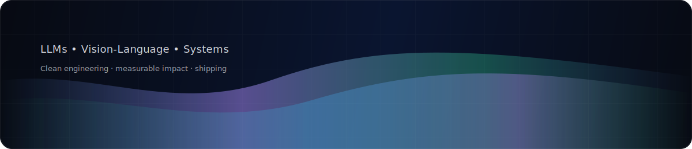

<h2 align="center">Syeda Anshrah Gillani</h2>

  

  <a href="https://medium.com/@syedaanshrah16">Medium</a> ·
  <a href="https://www.youtube.com/@SyedaAnshrahGillani">YouTube</a> ·
  <a href="https://www.linkedin.com/in/syeda-anshrah-gillani-788204263/">LinkedIn</a> ·
  <a href="https://scholar.google.com/citations?user=OFnkXDQAAAAJ&hl=en">Google Scholar</a>

  

### What I do
- **LLMs & Vision-Language**: training, fine-tuning, evaluation, and deployment  
- **Practical AI systems**: retrieval, agents, and production-grade pipelines  
- **Focus**: reliability, measurable improvements, clean engineering

### Collaboration
Open to research + engineering collaboration where **quality and impact** matter.
