  

  
  

  AI Engineer · LLMs · Vision-Language · Applied Deep Learning

  <a href="https://medium.com/@syedaanshrah16">Medium</a> ·
  <a href="https://www.youtube.com/@SyedaAnshrahGillani">YouTube</a> ·
  <a href="https://www.linkedin.com/in/syeda-anshrah-gillani-788204263/">LinkedIn</a> ·
  <a href="https://scholar.google.com/citations?user=OFnkXDQAAAAJ&hl=en">Google Scholar</a>

---

**What I do**  
I build reliable AI systems around **LLMs** and **Vision-Language** — from research experiments to production-grade pipelines.

**Principles**  
- correctness > vibes  
- simple > clever  
- measurable impact

  
<b>Focus areas</b>

- RAG + retrieval quality (evaluation, reranking, grounding)
- agentic workflows (planning, tool use, guardrails)
- multimodal understanding (LVLMs, VLM pipelines)
- deployment (latency, cost, observability)

  
<b>Collaboration</b>

If you’re working on applied LLM/VLM systems, evaluation, or ML tooling — happy to connect.

